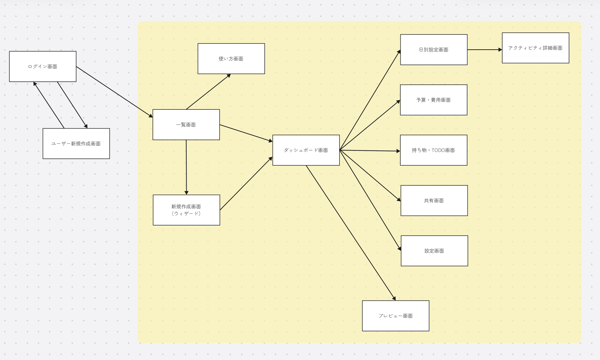

# 旅行しおり作成アプリ

## 使用技術

<p>
  <a href="https://nextjs.org/"></a>
  <a href="https://react.dev/"></a>
  <a href="https://www.typescriptlang.org/"></a>
  <a href="https://tailwindcss.com/"></a>
  <a href="https://supabase.com/"></a>
  <a href="https://www.postgresql.org/"></a>
  <a href="https://nodejs.org/"></a>
  <a href="https://eslint.org/"></a>
  <a href="https://postcss.org/"></a>
  <a href="https://vercel.com/turbopack"></a>
</p>

- Next.js 15 / React 19 / App Router / Turbopack
- TypeScript
- Tailwind CSS v4
- Supabase v2（Postgres, Auth, RLS）
- ESLint / PostCSS
- Node.js 18 以上

## プロジェクト概要
旅行前の計画や準備、旅行中の予定確認に使用する「旅のしおり」を作成するアプリケーションです。
機能は、日程ごとの予定を一覧化しタイムスケジュールに沿って予定を作成する機能や、旅行前の予約や持ち物の準備などをリスト化し共有できる機能があります。
本アプリの目的としては、旅行の際に最低限必要な情報のみを可視化できることと、共有できること、旅のしおりの作成に手間がかからないこととしているため、使いやすさを重視して実装となっています。
技術的な面では、ログイン機能やユーザー登録機能を実装し、ログインできる登録されたユーザーごとに旅のしおりを作成することができます。
データベース（バックエンド部分）は Supabaseを利用し、行レベルセキュリティ（RLS）で、ユーザー登録やデータ管理、メンバー権限を制御しています。

## アプリURL
- https://travel-app-x46b.vercel.app/

## 環境変数
- NEXT_PUBLIC_SUPABASE_URL
- NEXT_PUBLIC_SUPABASE_ANON_KEY

## テスト用アカウント
- メールアドレス 
  ```
  test@example.com
  ```
- パスワード
  ```
  pw0rd1111
  ```

データは `lib/supabase/sql/dev_seed.sql` を使用しています。

## 画面一覧
| 画面名 | パス | 説明 |
| --- | --- | --- |
|LP| `/` | ランディング（ログイン済みなら `/trips` へ自動遷移） |
|ログイン| `/auth/login` | ログイン（成功後は `/trips` へ） |
|使い方| `/guide` | 使い方ガイド |
|一覧| `/trips` | 作成した「旅行しおり」の一覧 |
|新規作成| `/trips/new` | 「旅行しおり」新規作成ウィザード |
|ダッシュボード| `/trips/[tripId]` | ダッシュボード（各機能画面へのハブ） |
|アクティビティ一覧| `/trips/[tripId]/activities` | 行程の一覧・作成・編集・並べ替え |
|アクティビティ詳細| `/trips/[tripId]/activities/[activityId]` | 個別行程の詳細/編集 |
|日別設定| `/trips/[tripId]/days` | 日付単位の計画管理 |
|持ち物・TODO| `/trips/[tripId]/tasks` | タスク・持ち物の一覧・作成・更新・削除 |
|予算・費用| `/trips/[tripId]/budget` | 予算と支出の表示・支出登録 |
|共有| `/trips/[tripId]/share` | メンバー招待・権限設定・共有リンク管理 |
|設定| `/trips/[tripId]/settings` | タイトル・日付・アーカイブ等の設定 |
|プレビュー| `/trips/[tripId]/preview` | 作成した「旅行しおり」のプレビュー |

##### 画面一覧のツリー
```
app/
├── layout.tsx
├── loading.tsx
├── page.tsx
├── auth/
│   └── login/
│       └── page.tsx
├── guide/
│   └── page.tsx
└── trips/
    ├── loading.tsx
    ├── page.tsx
    ├── new/
    │   └── page.tsx
    └── [tripId]/
        ├── layout.tsx
        ├── page.tsx
        ├── activities/
        │   ├── page.tsx
        │   └── [activityId]/
        │       └── page.tsx
        ├── budget/
        │   └── page.tsx
        ├── days/
        │   └── page.tsx
        ├── preview/
        │   └── page.tsx
        ├── settings/
        │   └── page.tsx
        ├── share/
        │   └── page.tsx
        └── tasks/
            └── page.tsx
```

## 画面遷移図


▼以下のウェブアプリケーションから画面遷移図を作成しました。<br>
https://boardmix.com/jp/

## API ルート
詳細は `lib/docs/api-routes.md` を参照してください（各エンドポイントのメソッド/説明を掲載）。

## ディレクトリ構成
- `app/` Next.js App Router のアプリ本体
  - `app/api/` API ルート群（サーバサイドのハンドラ）
    - `app/api/trips/` トリップ関連エンドポイント（`new`, `[tripId]` 配下に index/activities/days/tasks/budget など）
  - `app/auth/` 認証関連の画面（`login`）
  - `app/guide/` ガイド画面
  - `app/trips/` トリップの画面群（一覧、新規、`[tripId]` 配下に各サブ画面）
- `components/` 共通 UI コンポーネント
  - `components/layout/` ヘッダー/フッター等のレイアウト系
  - `components/marketing/` ランディング等のマーケ用
  - `components/shadcn/ui/` shadcn ベースの UI プリミティブ
  - `components/ui/` アプリ固有の UI コンポーネント
- `lib/` ライブラリ類
  - `lib/docs/` ドキュメント（開発ガイド、画面一覧、ER 図、API 仕様、テーブル定義 ほか）
  - `lib/supabase/` Supabase クライアントと SQL（`server.ts`/`client.ts`/`admin.ts`、`sql/` にスキーマやシード）
- `styles/` グローバル CSS（Tailwind v4）
- `types/` 型定義（DB 型、アプリ用型）
- ルート設定ファイル（`.env.local`, `.gitignore`, `eslint.config.mjs`, `next-env.d.ts`, `next.config.ts`, `package.json`, `postcss.config.mjs`, `tsconfig.json`）

## データベース（Supabase）
- スキーマ/ポリシーは `lib/supabase/sql/table_schema.sql` に記載。
- 行レベルセキュリティ（RLS）有効。メンバーのみ参照、編集は owner/editor のみ等をポリシーで制御。
- テーブル定義は `lib/docs/table-definitions.md`、ER 図は `lib/docs/er-diagram.md` を参照。

## 関連ドキュメント一覧
補足説明・設計書を格納しています。
- テーブル定義：`lib/docs/table-definitions.md`
- ER 図：`lib/docs/er-diagram.md`
- 画面一覧：`lib/docs/screens.md`
- API ルート一覧・説明：`lib/docs/api-routes.md`
- その他の構成一覧：`lib/docs/structure-others.md`

