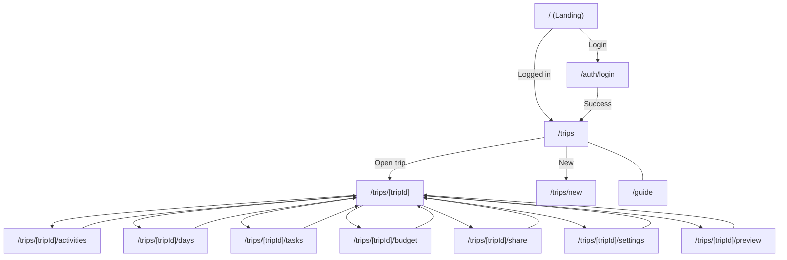

# Travel App

Next.js 15（App Router）と Supabase v2 を用いた旅行計画アプリです。トリップ、日別計画（Days）/行程（Activities）、タスク、支出/予算、共有リンク、メンバー権限（RLS）をサポートします。

## プロジェクトの概要
- ログイン後に自分のトリップ一覧を表示し、新規作成や各トリップの詳細管理ができます。
- 行程（Activities）の日付割り当て、並び替え、タスク管理、支出記録と予算の把握、共同編集者の招待・権限管理に対応します。
- DB は Supabase（PostgreSQL）を利用し、行レベルセキュリティ（RLS）でメンバー権限を制御します。

## 使用している主な技術
- Next.js 15 / React 19 / App Router / Turbopack
- TypeScript
- Tailwind CSS v4
- Supabase v2（Postgres, Auth, RLS）
- ESLint / PostCSS

## 必要要件
- Node.js 18 以上
- Supabase プロジェクト（ローカル or クラウド）

## 必要な環境変数
`.env.local` に以下を設定します。
- `NEXT_PUBLIC_SUPABASE_URL`（Supabase プロジェクトURL）
- `NEXT_PUBLIC_SUPABASE_ANON_KEY`（Anonキー）
- `SUPABASE_SERVICE_ROLE_KEY`（必要に応じて。管理系処理で使用）

例:
```
NEXT_PUBLIC_SUPABASE_URL=https://xxxxx.supabase.co
NEXT_PUBLIC_SUPABASE_ANON_KEY=eyJhbGciOi...
SUPABASE_SERVICE_ROLE_KEY=eyJhbGciOi...
```

## コマンド一覧
- 開発サーバ起動: `npm run dev`
- ビルド: `npm run build`
- 本番起動: `npm start`
- Lint: `npm run lint`

## 画面一覧（全件・説明）
- `/` ランディング。ログイン済みなら `/trips` へ自動遷移。
- `/auth/login` ログイン画面（Email/Password）。成功後 `/trips` へ。
- `/guide` 使い方ガイド。
- `/trips` 自分が閲覧可能なトリップ一覧。
- `/trips/new` 新規トリップの作成フロー。
- `/trips/[tripId]` トリップ概要（各機能へのハブ）。
- `/trips/[tripId]/activities` 行程の一覧・作成・編集・並べ替え。
- `/trips/[tripId]/activities/[activityId]` 個別行程の詳細/編集。
- `/trips/[tripId]/days` 日付単位の計画管理（Trip Day）。
- `/trips/[tripId]/tasks` タスクの一覧・作成・更新・削除。
- `/trips/[tripId]/budget` 予算と支出の表示・支出登録。
- `/trips/[tripId]/share` メンバー招待・権限設定・共有リンク管理。
- `/trips/[tripId]/settings` タイトル・日付・アーカイブ等の設定。
- `/trips/[tripId]/preview` プレビュー用の読み取りビュー。
- （補足）`app/layout.tsx` は全体レイアウト、`app/trips/loading.tsx` 等は読み込み中のスケルトン表示です。

## 画面遷移図


## API ルート
詳細は `lib/docs/api-routes.md` を参照してください（各エンドポイントのメソッド/説明を掲載）。

## ディレクトリ構成（全件・説明／ファイル詳細なし）
- `app/` Next.js App Router のアプリ本体。
  - `app/api/` API ルート群（サーバサイドのハンドラ）。
    - `app/api/admin/` 開発/管理系エンドポイント（`dev-seed`、`profiles/sync`、`users/lookup`）。
    - `app/api/trips/` トリップ関連エンドポイント（`new`、`[tripId]` 配下に index/activities/days/tasks/budget 等）。
  - `app/auth/` 認証関連の画面（`login`）。
  - `app/guide/` ガイド画面。
  - `app/trips/` トリップの画面群（一覧、新規、`[tripId]` 配下に各タブ画面）。
- `components/` 共有 UI コンポーネント。
  - `components/layout/` ヘッダー/フッター等のレイアウト系。
  - `components/marketing/` ランディング等のマーケ用。
  - `components/shadcn/ui/` shadcn ベースの UI プリミティブ。
  - `components/ui/` アプリ固有の UI コンポーネント。
- `lib/` ライブラリ類。
  - `lib/docs/` ドキュメント（開発ガイド、画面一覧、ER図、API 仕様、テーブル定義、ほか）。
  - `lib/supabase/` Supabase クライアントと SQL。（`server.ts`/`client.ts`/`admin.ts`、`sql/` にスキーマ/シード）
- `styles/` グローバル CSS（Tailwind v4）。
- `types/` 型定義（DB 型、アプリ用型）。
- ルート設定ファイル（抜粋）: `.env.local`, `.gitignore`, `eslint.config.mjs`, `next-env.d.ts`, `next.config.ts`, `package.json`, `postcss.config.mjs`, `tsconfig.json`。

## データベース（Supabase）
- スキーマ/ポリシーは `lib/supabase/sql/table_schema.sql`。
- 行レベルセキュリティ（RLS）有効。メンバーのみ参照、編集は owner / editor のみ等をポリシーで制御。
- テーブル定義の要約と ER 図は `lib/docs/` を参照。

## 関連ドキュメント（lib/docs）
- 開発ガイド: `lib/docs/dev.md`
- テーブル定義サマリ: `lib/docs/table-definitions.md`
- ER図: `lib/docs/er-diagram.md`
- 画面一覧: `lib/docs/screens.md`
- API ルート一覧・説明: `lib/docs/api-routes.md`
- app/api 以外の構成一覧: `lib/docs/structure-others.md`

## トラブルシューティング
- 画面が空/エラーになる: 環境変数（Supabase URL/Key）が未設定でないか確認。
- 認可エラー（RLS）でデータが取得できない: 該当ユーザーがトリップのメンバーか、またはオーナーか確認。
- `createServer()` / `createClientBrowser()` が失敗する: `.env.local` が正しく設定され、最新値が反映されているか確認。
- シードが入らない: Supabase SQL Editor でエラーが出ていないか、対象のユーザーUUIDをパラメータに渡しているか確認。

## ライセンス
本リポジトリのライセンスはプロジェクト管理者の方針に従います。

